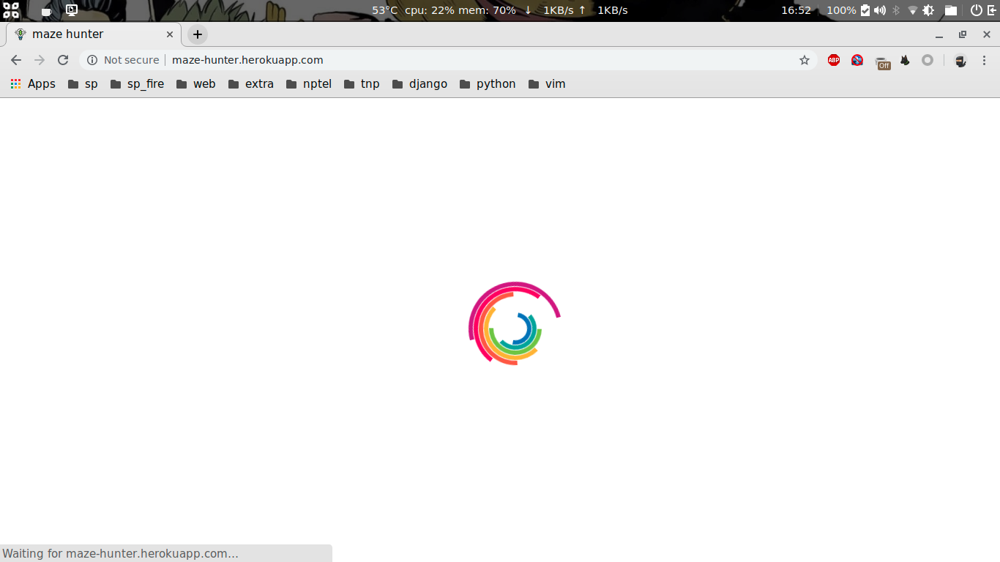
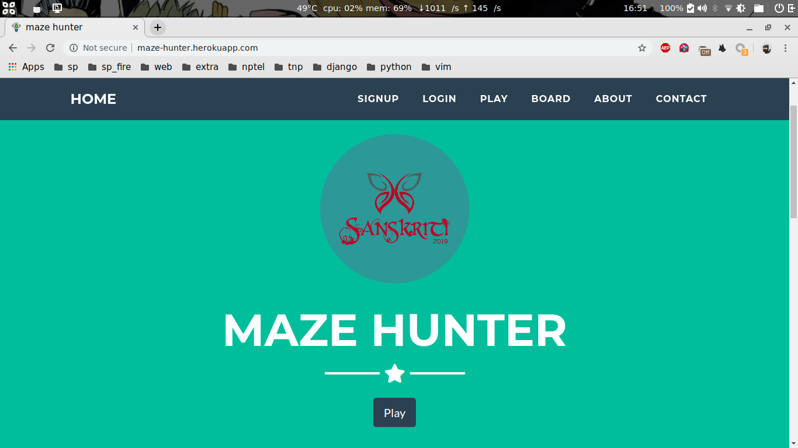
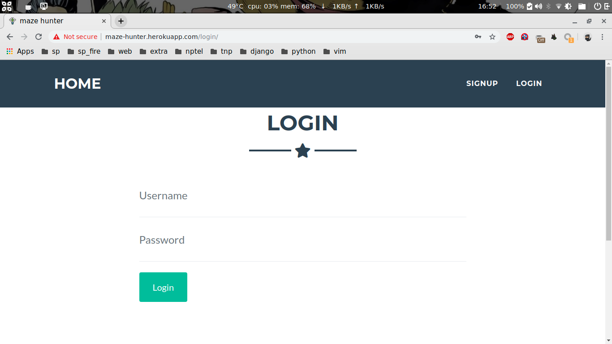
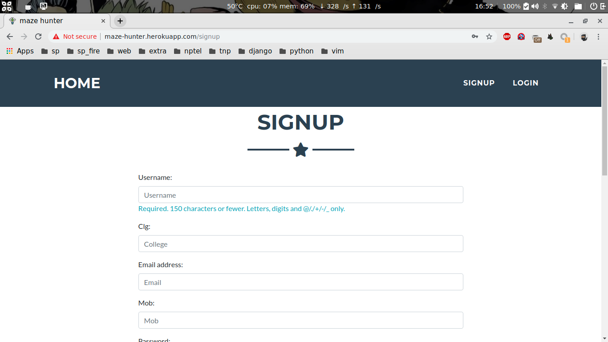
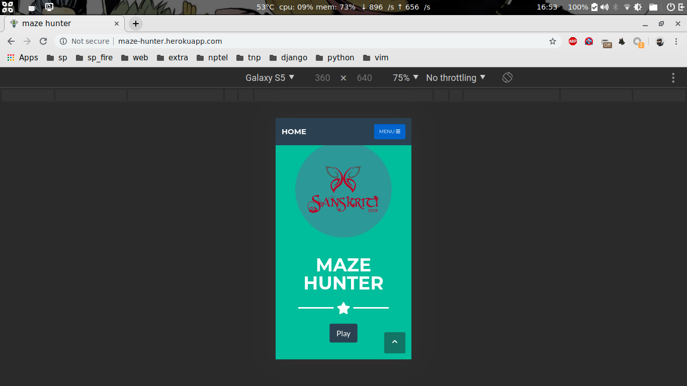
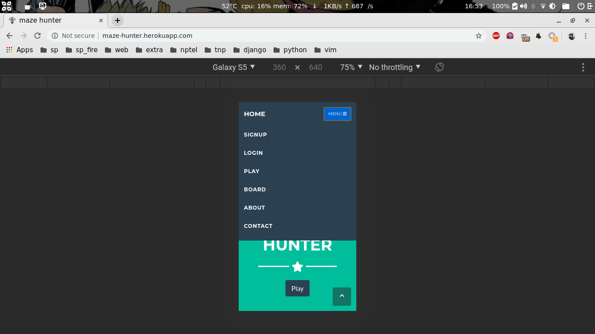

# maze-hunter

* Its a puzzle based online game created using django framework.
* It can be easily uploaded and hosted to heroku.
* Mobile compatible and has a count down timer.
* Provided support for PostgreSQL db, default db is SQLite3.

## Screenshots

### Loader

### Home page

### Login

### Signup

### Mobile view

##  INSTALL 

*	git clone https://github.com/ask1234560/maze-hunter.git
*	cd maze-hunter
*	python3 must be installed
*	pip3 install pipenv
### installs all required packages
*	pipenv sync 			
*	pipenv shell
### run the application in localhost:8000
*	python manage.py runserver 8000	
### view the website
*	http://localhost:8000/			

